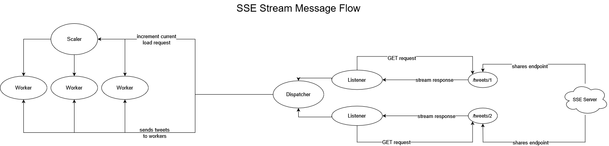

# *Tweet Processor Design*

## **Libraries**

Genserver - built-in module. Required to work with processes and handle requests. 

HTTPoison - required to read SSE streams asynchroniously. (Also has an equivalent like HTTPotion)

Jason - required to decode the incoming stream into a map. (Also has an equivalent like Poison)

Logger - built-in module. Required to log information. 

---

## **Actor - Superviser Description**

Actors - elixir actors are defined as the processes of the BEAM. 
For now, there is a need in only single type of actor, 
the one which will process the SSE streams.

Supervisor - they are the processes which are created to supervise the children(supervised processes). 
By default, they do by building a Supervision Tree.
Supervision trees provide fault-tolerance and encapsulate how our applications start and shutdown, 
so it a must to have it in our application. 
This project needs a supervisor which can add workers on demand.

---

## **Endpoints**

### **Streaming API Endpoints**

localhost:4000/tweets/1 -> First SSE Stream Endpoint

localhost:4000/tweets/2 -> Second SSE Stream Endpoint

localhost:4000/tweets/emotion_values -> Second SSE Stream Endpoint. (For now, not needed)

### **Actor Request Endpoints**

SSE Chunks Handle Endpoint -> handles the ongoing events
(may be branched depending on the events)

SSE Header Handle Endpoint -> handles HTTP header

SSE Connection Status Handle Endpoint -> handles the current HTTP connection status

---

### Architecture Diagram

This diagram describes the processing and dispatching of two Twitter feeds.

This diagram describes the subsequent Worker Supervisor actions.

