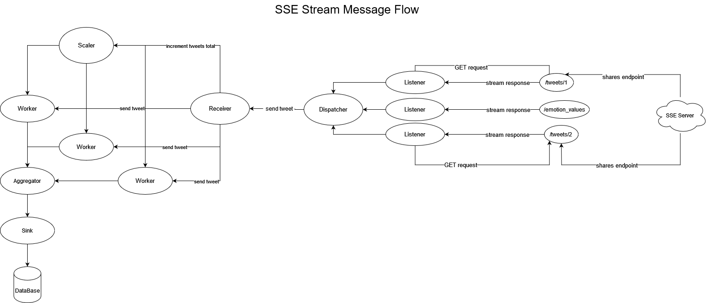
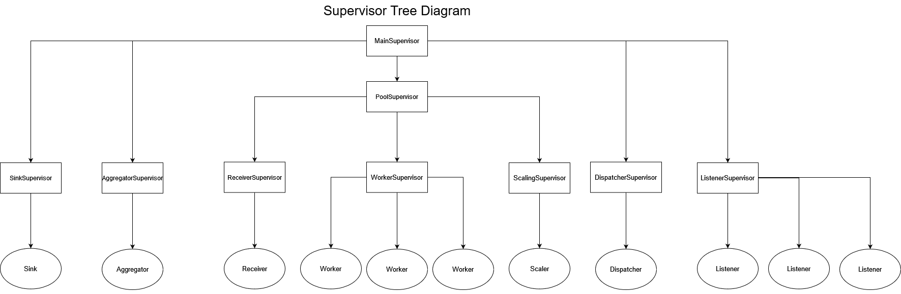

# *Tweet Processor Design*

## **Libraries**

Genserver - built-in module. Required to work with processes and handle requests. 

HTTPoison - required to read SSE streams asynchroniously. (Also has an equivalent like HTTPotion)

Jason - required to decode the incoming stream into a map. (Also has an equivalent like Poison)

Logger - built-in module. Required to log information. 

Postgrex - PostgreSQL driver for Elixir.

Ecto - database wrapper. (optional) 
---

## **Actor - Superviser Description**

Actors - elixir actors are defined as the processes of the BEAM. 
The current plan proposes to use next actors:
1) Worker -> to process tweets
2) Listener -> to read SSE Stream
3) Dispatcher -> to send json messages to receiver
4) Receiver -> to receive dispatched message into a worker pool.
5) Scaler -> to autoscale workers depending on the load
6) Aggregator -> to batch the incoming date from the pools.
7) Sink -> to insert batched data into a database

Supervisor - process, which is created to track its children's(supervised processes) state. 
By default, they do so by building a Supervision Tree.
Supervision trees provide fault-tolerance and encapsulate how our applications start and shutdown, 
so it a must to have it in our application. 

---

## **Endpoints**

### **Streaming API Endpoints**

localhost:4000/tweets/1 -> First SSE Stream Endpoint

localhost:4000/tweets/2 -> Second SSE Stream Endpoint

localhost:4000/tweets/emotion_values -> Third SSE Stream Endpoint.

### **Actor Request Endpoints**

SSE Chunks Handle Endpoint -> handles the ongoing events
(may be branched depending on the events)

SSE Header Handle Endpoint -> handles HTTP header

SSE Connection Status Handle Endpoint -> handles the current HTTP connection status

---

### Architecture Diagram

This diagram describes the process of accepting, dispatching and scaling of messages from two twitter feeds.

This diagram describes Supervisor Tree Structure.

